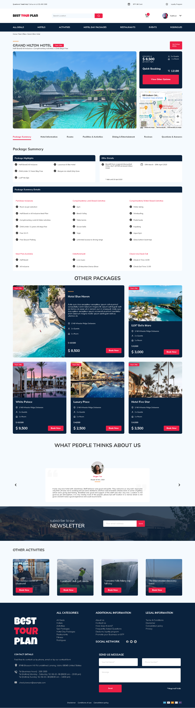

# Angular Landing Page

A landing page create with [Angular CLI](https://github.com/angular/angular-cli).

# Table of contents:

[Info](#info)

[Technolgies](#technologies)

[How to run](#how-to-run)

[Screenshots](#screenshots)

# Info:

Template by [Mohammad Ali available in Freebiefy](https://freebiefy.com/free-hotel-booking-website-template-for-figma/).

# Technologies:

# How to run

### Install all dependencies:

#### `npm i`

### Start development server:

#### `ng serve`

### Open a browser and navigate to `http://localhost:4200/home`.

# Screenshots

